# Bookworm

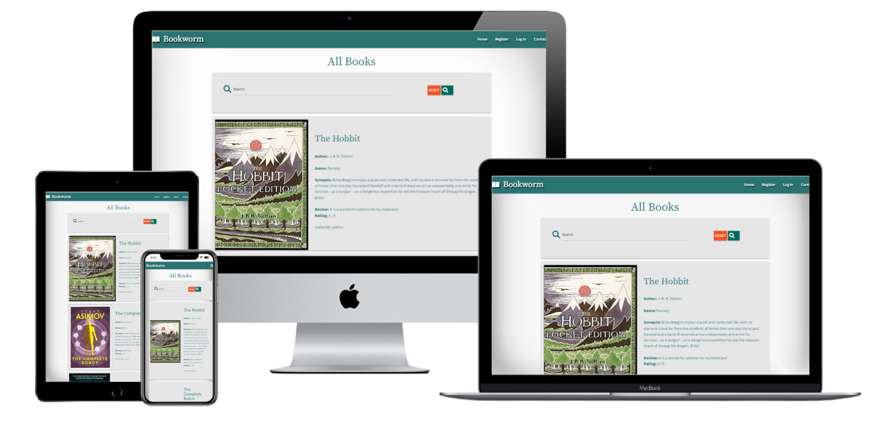

View the deployed site [here:](https://bookworm-project3.herokuapp.com/)

## User Experience (UX)

---

## Introduction
Bookworm is an interactive book review site for all book fans. The site allows registered users to search through the listed books for reviews and find their next book. Bookworm allows users to share their book reviews with fellow book lovers on the site. The site also allows registered users to keep a library of their own added books on their profile page. 

---

## User Stories 

- Unregistered User
    1. As an unregistered user, I want to be able to search for books on the site.
    2. As an unregistered user, I want to  be able to view reviews for each book.
    3. As an unregistered user, I want to  be able to Register as a new User on the site.    
    4. As an unregistered user, I want to  be able to get visual feedback when an action is completed.
    5. As an unregistered user, I want to  be able to contact the Site Owner with any questions or suggestion.

* Registered user
    1. As a registered user, I want to be able to login and logout of the site.
    2. As a registered user, I want to be able to search for books.
    3. As a registered user, I want to be able to add books.
    4. As a registered user, I want to be able to view all books that I have added on my profile page.
    5. As a registered user, I want to be able to edit my books and my reviews.
    6. As a registered user, I want to be able to delete my books.
    7. As a registered user, I should not be able to delete or edit other user’s books.

- Site Admin
    1. As the site owner, I want to be able to add books.
    2. As the site owner, I want to be able to edit any book.
    3. As the site owner, I want to be able to delete any book.
    4. As the site owner, I want to be able to add a genre.
    5. As the site owner, I want to be able to edit a genre.
    6. As the site owner, I want to be able to delete a genre.
   
---

## Features
### Current Features

* Site is responsive on all screen sizes.
* Nav menu adjusts accordingly to unregistered, registered users and Admin depending on the users log in status.
* Identical footer and Navigation bar displayed across the site to provide continuity.
* Search bar on home page and profile page enables both registered and unregistered users to search for books by book title or author.
* Site visitors can register on the site.
* Registered users can log in and out of the site.
* Registered users can add books to the site, the book will also be displayed in their Library shown on their Profile page.
* Registered users can only edit their own added book.
* Registered users can only delete their own books.
* Admin users can add, edit and delete any books.
* Admin user can add, edit and delete any genre.
* Before a user deletes a book a confirmation is required preventing accidental deletion.
* Cancel buttons are also shown alongside edit and delete buttons in case the user changes their mind and wants to cancel changes.
* Social Media Links displayed in the footer on all pages.
* Contact Page allows user to contact site owner.
* Flash messages providing user feedback for registered users when initially registered, logged in, logged out.

---

### Future Features

* Registered Users can review books before adding them to the site.
* Admin users can edit the users password.
* Admin users can delete any users account.
* Pagination for the Home and Profile Pages
* Separate review section linked to the book for more in depth reviews.
* Allow all users to review any book and to rate the book
* Function to add all rating scores provide an average overall rating for the book.

---

## Structure
* Home Page
All users can view the Home page whether they are logged in or not. The Search bar is visible at the top of this page for logged in or out users and they are able to search books on the database by author or title. 
All books in the database are list on the home page. Users are presented with additional edit and delete buttons at the bottom of each book card, allowing them to edit or delete their own books. The admin user will have the edit and delete buttons at the bottom of every book card, enabling admin to delete or edit any book in the database.
* Profile
The profile navigation link is only available to logged in users. Once selected, the user is taken to their own Library page with their username and Library as a heading. Books added by the user are displayed along with the edit and delete buttons to manage their library.

* Add Book
The add book menu item is available to all logged in users. Once selected, the user is presented with a form where the user is required to complete all fields including, Book Title, Author, Genre(a dropdown list selection displays all available genres), Synopsis. There is also a field for Review, where the user can input a short comment on the book, this is followed by a Rate Book field where the user can select from the dropdown field a score between 0 and 5. Finally there is a field for the Cover URL to display the books cover on the database. There is an additional Add Book button at the bottom to submit the form along with a cancel button to allow the user to come out of the form if they entered there by mistake.

* Manage Genres
This navigation link is only available to the admin user when logged in. 
Once selected, the admin user is presented with a page of cards displaying each genre on the database along with an edit and delete button to edit or delete existing genres on the database.
At the top centre of the page there is an Add Genre button allowing the user to add a new genre to the database, once selected the admin user is presented with a form with a single text input to enter the new genre. There is also an Add Genre button and delete button on the card to either submit or cancel out of the form.  

* Log Out
The Log Out navigation link is only available to logged in users. This allows the current user to log out, once selected they are presented with a flash message “You are now logged out”, the user is also redirected to the Log In screen.

* Log In
The Log In navigation link is available to all logged out or unregistered users. There is a simple form with two test inputs for Username and Password, both have to match to allow the user access. Once these two fields are completed the user has to press the Log In button. If a user does not complete a field a please fill out this field message is displayed. If a user enters an incorrect username and or password a flash message is displayed prominently across the top of the page “Incorrect Username and/or Password, please try again”. There is also a message displayed at the bottom of the Log In screen, “New to Bookworm? Register Here!” With Register Here! Taking the visitor to the Register page.

* Register
The Register navigation link is available to all logged out or unregistered users. There is a simple form with two test inputs for Username and Password, the Username and Password fields have to be between 5 and 15 characters a-z, A-Z or 0-9, no special characters allowed. 
Once these two fields are completed the user has to press the Register button. If a user does not complete a field in the correct format a message is displayed “Please match the selected format”. If a user enters a valid username and password a flash message is displayed prominently across the top of the page “You have successfully registered!”. The new user is directed to their profile page.

* Contact
The Contact navigation link is available to logged in/out users and unregistered visitors. Once selected the user is presented with a contact form with four fields, First Name, Last Name, Email and Your Comments. There is a send button at the bottom centre of the form.

---

### Database Schema
There are three collections in the MongoDB database:
1. users
2. books
3. genres

The database schema is shown below.

---

## Design
### Colour Scheme
I used [Coolors](https://coolors.co/) to generate a colour scheme, I chose this particular colour scheme because I did not want to go with the usual browns of a book review site. I wanted the site to stand out from other book review sites by including a more colourful palette.

The colours chosen are intended to convey the feeling of relaxation and calmness when reading a book, while also attracting new user to the site. I selected only three of the colours to keep the site simple and less busy, with white as an additional colour for some text. 

The main colour used on all nav bars and footers was #297373 with white text to ensure excellent readability. The main background colour was left as white #ffffff to ensure the book cards stood out on the page. This background colour was also perfect to use the #297373 again for the text. All cards use the colour #E6E6E6 from my colour palette with the text colour of #297373, once again ensuring that it could be easily read and complimented the background colour. 

[Adobe Color-Wheel](https://color.adobe.com/create/color-wheel) was used to match a complimentary colour for all edit/add buttons on the #297373 background, #ffffff was chosen as this colour stood out and highlighted the buttons on the page. All Cancel/Delete buttons are #FF8552 with white text #ffffff.
All text passed on the contrast checker on the [Adobe Color](https://color.adobe.com/create/color-contrast-analyzer) using the corresponding hex values for the  analyser ensuring excellent readability. 

---

### Typography

I used [Google Fonts](https://fonts.google.com/) to import the fonts used for this site. 
The __Source Serif Pro__ font is used for all headers and titles. Designed by Frank Grießhammer, from the Adobe Originals program started in 1989 as an in-house type foundry at Adobe.
__Source Sans Pro__ was designed to perfectly compliment Source Serif Pro, I used the Source Sans Pro font for the main text throughout the site. Both fonts work perfectly together, they are easy to read and help convey the subject of the site.
Both fonts are fully cleared for both personal and commercial use.

---

### Imagery
I have not used a background image on this site because I felt it would distract from the main focus of the site, the actual books with their cover images. Book cover images were taken directly from [Amazon](https://www.amazon.co.uk/).

Icons from [Font Awesome](https://fontawesome.com/) are used throughout the site. The icons help inform the user of the purpose of a particular section and lead to a more enjoyable user experience. I have also used a Font Awesome icon as my main logo displayed throughout the site.

---

### Wireframes

The wireframes for the Bookworm site were produced using Balsamiq. 
* Mobile Wireframes:
  - [Home Logged Out/Not Registered Page](static/wireframes/home-logged-out-mobile.png)
  - [Register Page](static/wireframes/register-mobile.png)
  - [Log In Page](static/wireframes/login-mobile.png)
  - [Profile Page](static/wireframes/profile-mobile.png)
  - [Add Book Page](static/wireframes/add-book-mobile.png)
  - [Edit Book Page](static/wireframes/edit-book-mobile.png)
  - [Admin Profile Page](static/wireframes/admin-profile-mobile.png)
  - [Admin Manage Genres](static/wireframes/manage-genres-mobile.png)
  - [Contact Page](static/wireframes/contact-page-mobile.png)

* Desktop Wireframes:
  - [Home Logged Out/Not Registered Page](static/wireframes/home-logged-out-desktop.png)
  - [Register Page](static/wireframes/register-desktop.png)
  - [Log In Page](static/wireframes/logged-in-desktop.png)
  - [Profile Page](static/wireframes/profile-desktop.png)
  - [Add Book Page](static/wireframes/add-book-desktop.png)
  - [Edit Book Page](static/wireframes/edit-book-desktop.png)
  - [Admin Profile Page](static/wireframes/admin-profile-desktop.png)
  - [Admin Manage Genres](static/wireframes/manage-genres-desktop.png)
  - [Contact Page](static/wireframes/contact-page-desktop.png)

---

## Technologies Used

### Languages Used

* [HTML5](https://developer.mozilla.org/en-US/docs/Glossary/HTML5)
* [CSS3](https://developer.mozilla.org/en-US/docs/Web/CSS)
* [JavaScrip](https://www.javascript.com/)
* [Python3](https://www.python.org/)

---

### Frameworks, Libraries & Programs Used

* [Balsamiq:](https://balsamiq.com/)
Balsamiq was used to create the wireframes during the design process.
* [Google Fonts:](https://fonts.google.com/)
Google fonts were used to import the fonts used in this project.
* [MongoDB:](https://www.mongodb.com/) 
Cloud based database was used for all collections.
* [Flask:](https://flask.palletsprojects.com/en/2.1.x/) 
Micro framework used to build my application.
* [Materialize:](https://materializecss.com/)
Used for the structure, Navbar, Footer, Cards code used and modified for this project. 
* [Chrome DevTools:](https://developer.chrome.com/docs/devtools/)
Used throughout the project to view and edit the site in real time and discover issues and solutions.
* [Adobe Color:](https://color.adobe.com/create/color-contrast-analyzer)
The contrast checker used for this project.
* [Techsini:](https://techsini.com/multi-mockup/index.php)
To produce mockup image across multiple devices.
* [Gitpod:](https://gitpod.io/projects)
This was the code editor used throughout the project.
* [Git:](https://git-scm.com/)
Git was used for version control by utilizing the Gitpod terminal to commit to Git and Push to GitHub.
* [GitHub:](https://github.com/)
Github was used to host and deploy the website.
* [Heroku:](https://id.heroku.com/)
For deploying the application.

---

## Testing

Throughout the project I have been using DevTools on the Chrome browser to test changes to the HTML and CSS code. I have committed regularly and included detailed messages detailing the changes made.

The W3C Markup Validator and W3C CSS Validator Services were used to validate every page of the project to ensure there were no syntax errors in the project.

### W3C Markup Validator results:
The Validator results from the [W3C Markupm Validation Service](https://validator.w3.org/) showed no errors or warnings on the following pages.

* books.html

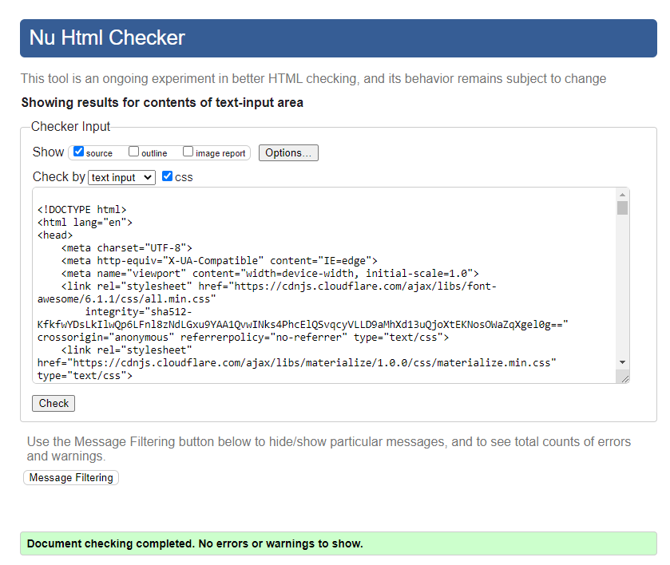

* add_books.html

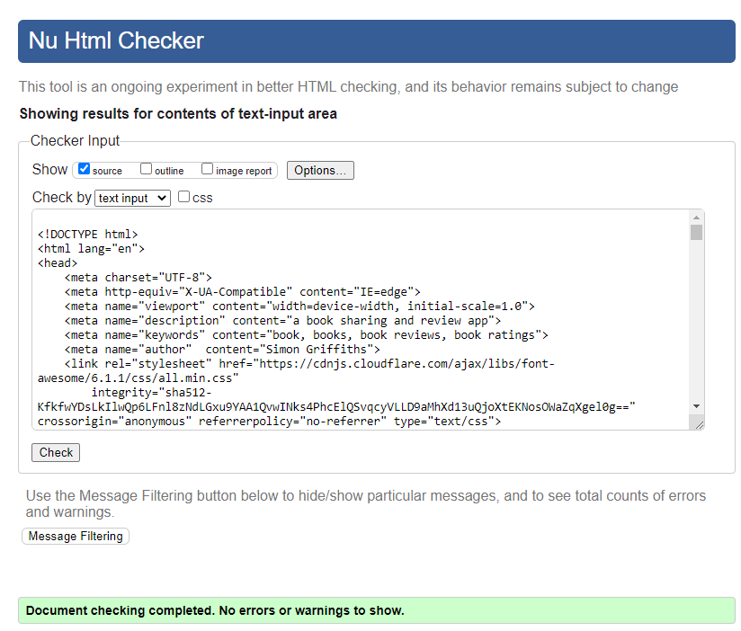

* genres.html

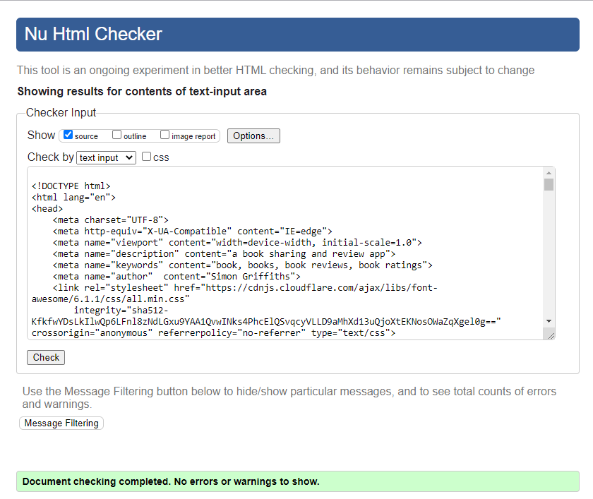

* add_genre.html

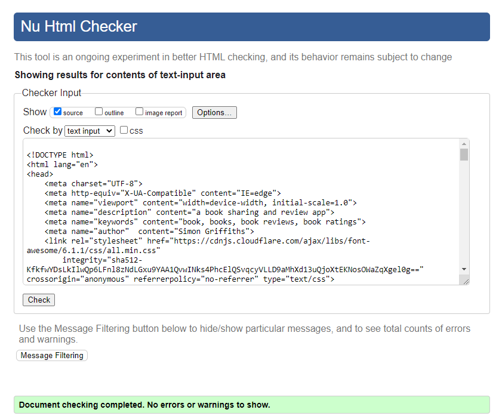

* contact.html

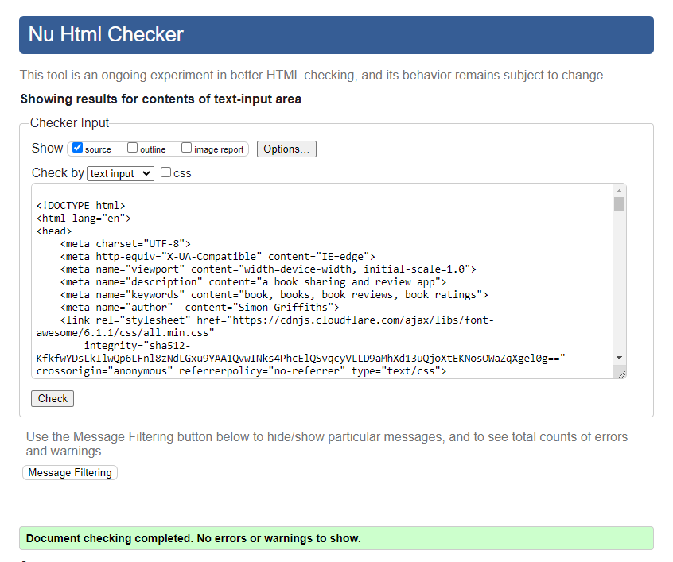

* edit_book.html

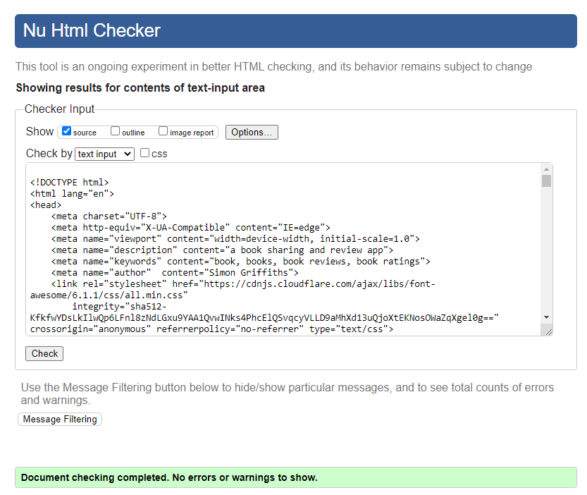

* edit_genre.html

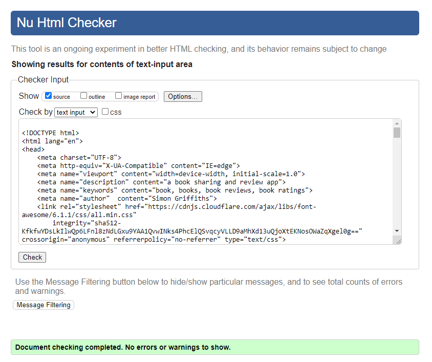

* login.html

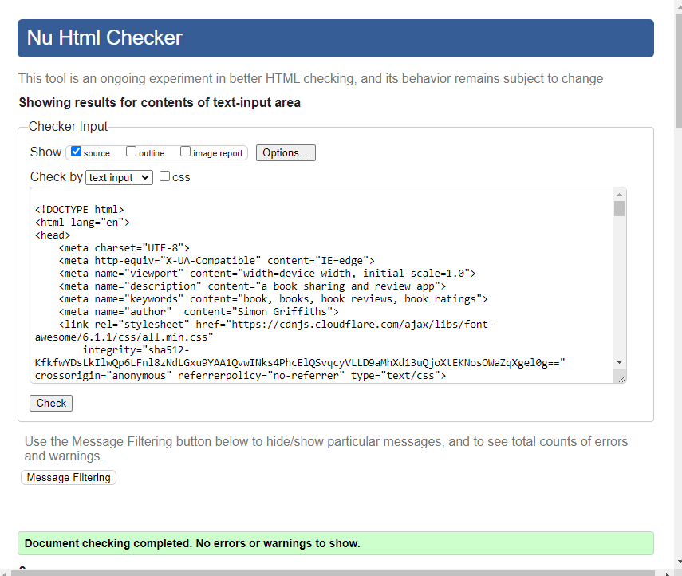

* profile.html

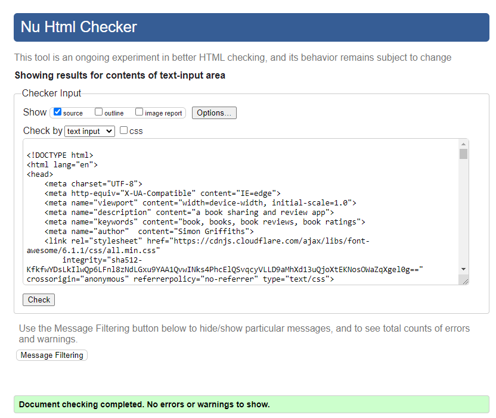

* register.html

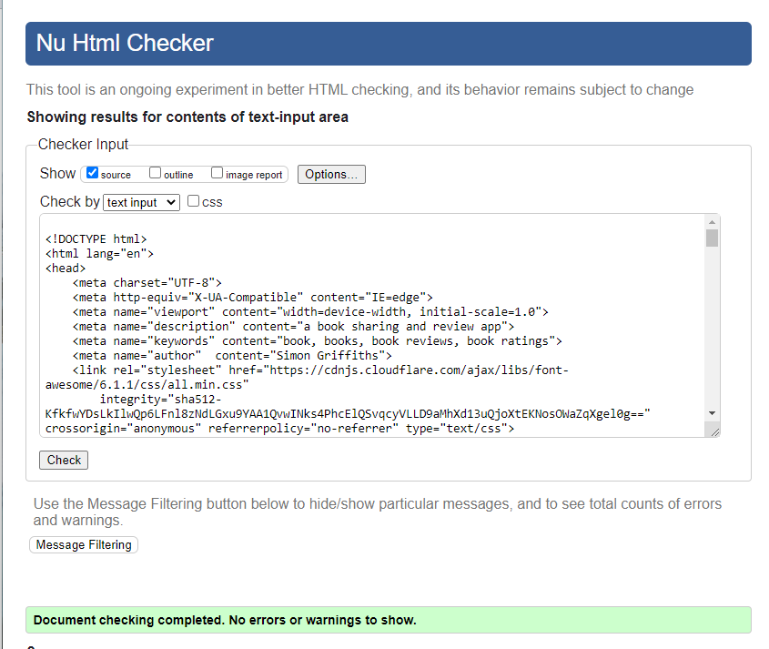

* 404.html

---

### W3C CSS Validation Results

The Validator results from the [W3C CSS Validation Service](https://jigsaw.w3.org/css-validator/) showed no errors or warnings.

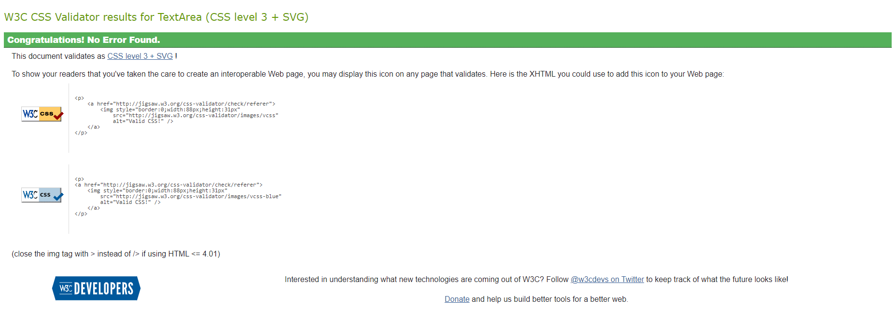

---

### JSHint Results

[JSHint](https://jshint.com/) was used to check the Javascript on this project, there were no errors or warnings reported.

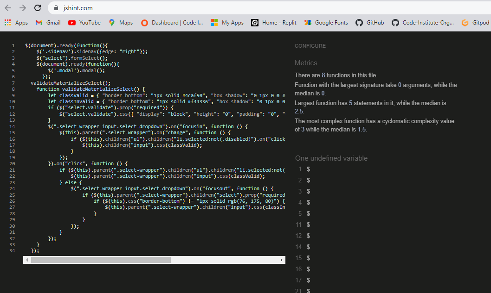

---

### Pep8 Validation

Python was checked to [PEP8](http://pep8online.com/) compliance and passed with no issues.

---

### Lighthouse Testing

For the Lighthouse testing SEO only reached a score of 86, when I checked the META descriptions hadn’t been added in my html, I added these and retested with scores of 100 for all pages.
I also had issues with the accessibility Scores of 80 for the *‘add book’*, *‘edit book’*, *‘get book’* and *‘get genre’* pages on both mobile and desktop view. I had the *‘Form Elements do not have associated labels’* warning, I added aria-label to all relevant areas and managed to increase the score to 97 for *‘get book’* and 96 for *‘get genre’*. I was also able to increase the accessibility score for *‘add book’* and *‘edit book’* to 88.As I was using Materialize I could not discover how to add the aria-labels for the two materialize drop down sections. I was therefore unable to increase the score further. 

* Mobile Testing

* [add_book](static/images/testing/lighthouse-add-book-mobile.png)

* [add_genre](static/images/testing/lighthouse-add-genre-mobile.png)

* [contact](static/images/testing/lighthouse-contact-mobile.png)

* [edit_book](static/images/testing/lighthouse-edit-book-mobile.png)

* [edit_genre](static/images/testing/lighthouse-edit-genre-mobile.png)

* [get_books](static/images/testing/lighthouse-get-books-mobile.png)

* [get_genres](static/images/testing/lighthouse-get-genre-mobile.png)

* [login](static/images/testing/lighthouse-login-mobile.png)

* [profile](static/images/testing/lighthouse-profile-mobile.png)

* [register](static/images/testing/lighthouse-register-mobile.png)

* Desktop Testing

* [add_book](static/images/testing/lighthouse-add-book-desktop.png)

* [add_genre](static/images/testing/lighthouse-add-genre-desktop.png)

* [contact](static/images/testing/lighthouse-contact-desktop.png)

* [edit_book](static/images/testing/lighthouse-edit-book-desktop.png)

* [edit_genre](static/images/testing/lighthouse-edit-genre-desktop.png)

* [get_books](static/images/testing/lighthouse-get-books-desktop.png)

* [get_genres](static/images/testing/lighthouse-get-genre-desktop.png)

* [login](static/images/testing/lighthouse-login-desktop.png)

* [profile](static/images/testing/lighthouse-profile-desktop.png)

* [register](static/images/testing/lighthouse-register-desktop.png)

---
### Testing User Stories

- Unregistered User
  1. As an unregistered user, I want to be able to search for books on the site. 
*Search function at the top of home page allows search under book title or author.*
  2. As an unregistered user, I want to  be able to view reviews for each book. 
*Unregistered users have access to the full range of books in the collection with reviews and ratings for each book.*
  3. As an unregistered user, I want to  be able to Register as a new User on the site *Registration form is available and allows a visitor to register on the site with a username and password.*
  4. As an unregistered user, I want to  be able to get visual feedback when an action is completed. 
*Flash messages are shown at various stages to provide user feedback e.g. login, logout.*
  5. As an unregistered user, I want to  be able to contact the Site Owner with any questions or suggestion. 
*There is a contact link that takes the visitor to a form where they can contact the site owner.*

* Registered user
  1. As a registered user, I want to be able to login and logout of the site. 
*Login and Logout navigation links take the user to the relevant form to either login or logout.*
  2. As a registered user, I want to be able to search for books. 
*Users have access to the full range of books in the collection with reviews and ratings for each book.*
  3. As a registered user, I want to be able to add books. 
  *The Add Book navigation link is present for logged in users that takes them to a form so that they can add the book details.*
  4. As a registered user, I want to be able to view all books that I have added on my profile page. 
*The Profile navigation link is available to logged in users, this takes them to their library where all their added books are displayed.*
  5. As a registered user, I want to be able to edit my books and my reviews. 
*The edit button is available on each of the users books to change the details if needed.*
  6. As a registered user, I want to be able to delete my books. 
*The delete button is available on each of the users books to delete books if needed.*
  7. As a registered user, I should not be able to delete or edit other user’s books. 
*Only the admin user can edit or delete every book in the collection, users are restricted to editing and deleting their own added books.*

- Site Admin
  1. As the site owner, I want to be able to add books. 
*The Add Book navigation link is present for logged in users that takes them to a form so that they can add the book details.*
  2. As the site owner, I want to be able to edit any book. 
  *The edit button is available on every book to change the details if needed.*
  3. As the site owner, I want to be able to delete any book. 
*The delete button is available on every book to delete books if needed.*
  4. As the site owner, I want to be able to add a genre. 
*The Manage Genres navigation link takes the admin user to the Manage Genres page where they can add a genre.*
  5. As the site owner, I want to be able to edit a genre. 
*On the Manage Genres page, all genres are shown with an edit and delete button on each.*
  6. As the site owner, I want to be able to delete a genre. 
*On the Manage Genres page, all genres are shown with an edit and delete button on each.*

---

### Manual Testing
* Chrome DevTools was used throughout the project to test and develop as I progressed through to completion. 
* The website has been tested on a number of devices including, iPhone SE, iPhone XR, iPhone 12 Pro, Pixel 5, Samsung Galaxy S8+, Samsung Galaxy S20 Ultra, Samsung Galaxy A51/71, Nest Hub and Nest Hub Max.
* Friends and family members were asked to review the app and test its responsiveness, they reported no user experience issues.
* The website was checked on various browsers: Google chrome, Microsoft Edge, Mozilla Firefox and Safari. Viewed all pages on each and checked the following:
* The main navigation links for Home, Profile, Add Book, Manage Genres, Log Out, Register and Contact take the user to the appropriate page.
*The Bookworm brand name and Logo link back to the Home page.
*The Search area was tested and works for searched that include the author’s name or book title. The reset button clears the entered search text, the Search icon carries out the search when selected and the relevant book/s are displayed. If no book in the database the flash message “No Results Found” is displayed.
* Edit and Delete buttons are also shown under the user’s books and are functioning as expected. The Edit Book form appears once the Edit button is selected presenting the user with the correct fields with the correct pre filled labels for the book. “Book Successfully updated” flash message displayed when a field has been edited, the cancel button returns the user to the home page.
When a user selected the delete button a message box is displayed asking the user to confirm deletion with a further Delete button to confirm and a cancel option on the left. Once deletion has been confirmed the book is removed from the database.
* Add Book navigation link takes the user to the Add Book Form with all relevant fields fully functional including dropdowns. The Add Book and Cancel buttons both function as expected. The user cannot add another book with the same title, the “This book already exists “ flash message displays when the user attempts to submit the form.
“Book Successfully Added” flash message displays once a book has been added to the database, then the user is directed back to the home page.
* Log in and Log Out screen perform as expected with all buttons directing the user to the appropriate page. The Login button directs the user to their profile page with the flash message of “Welcome,’username’. Log Out takes the user to the Home page with the flash message “You are logged out” and the logged out navigation links, Home, Register, Log In and Contact.
* Register opens their profile page with the flash message “You have successfully registered!” and underneath “username”’s Library.
* The Profile Navigation Link only displays for logged in users. Once selected the users’ name appears at the top of the Library Page along with all the books added by that user. When admin is logged in they have access to the entire collection of books on the database with full edit and delete access.
* The Social Media links on the footer direct the user to the relevant social media sites.

---

### Bugs

### Fixed Bugs

* Log Out Flash message
The Flash message “You are now logged out” would not appear, I discovered that in my logout function I had stated *‘session.clear()’*, I changed this to *‘session.pop(“user”)’* and it resolved the issue with the relevant flash message displayed on Logout.

* Book Genre Selection
I tried everything to fix the issue with the dropdown selection not functioning for the Genre selection, eventually after carefully inspecting my code I discovered that in my add_book function I had typed genre=mongo.db.genres, where the Mongo DB collection name was ‘genre’, correcting this typo led to a fully functioning Genre dropdown selection.

* Modal problems
I introduced a feature to seek deletion confirmation  in the form of a modal. During testing of this feature I discovered that the modal did work, but did not delete the selected book, it deleted the first book in the list. I did a lot of searching and eventually came across a post in ‘stackoverflow’ at https://stackoverflow.com/questions/67980542/delete-data-with-confirmation-modal where a I realised I had not identified the actual book by using {{ book_id }}, once this was corrected the delete button removed the correct button from the database. 

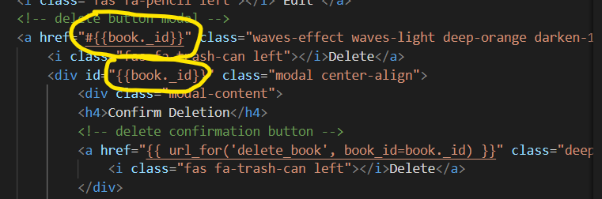, 

* Layout issues
During ongoing testing during the development of this site I discovered that my content displayed on the home page and Profile Pages were not displaying as anticipated. I intended to display one book card in each row with the book’s cover image on the left and the books text appearing on the right. This worked well up until small screens of 425px and below, where both the image and text were squashed within their column, this meant that the text was very difficult to read.  

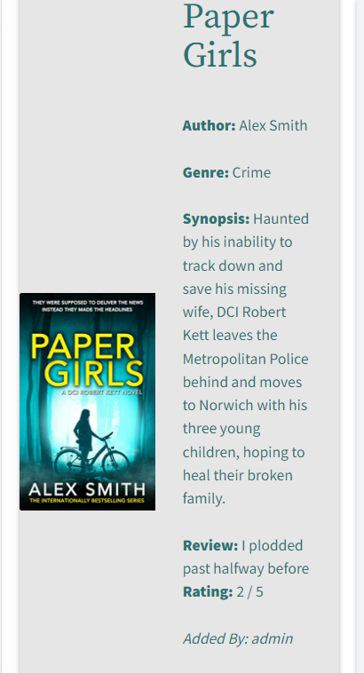 

Using the ‘card horizontal’ Materialize class. As I was using Materialise in this project for the first time I was unfamiliar with all the classes involved and default style values etc. I researched the issue thoroughly, but was unable to find any answers to my particular issue. Eventually, following a chat with Ed at Tutor Support, he was able to point me in the right direction by explaining that the ‘card horizontal’ Materialize class has it flex-direction set to row by default, to try changing this to flex-direction column. I applied this setting via media queried to the smaller screen size and this resolved the issue. 
 
 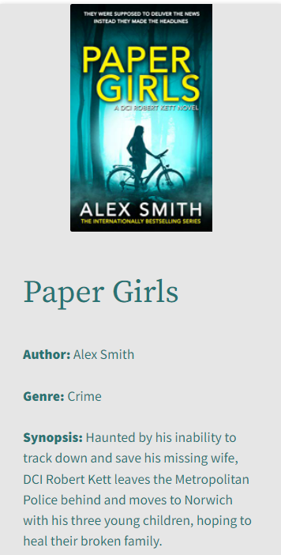

### Unfixed Bugs
* Users can enter a book title more than once on the site if the spelling is incorrect or missing out ‘The’ at the start of the title.

* Can't get the 404 page to function, unfortunately, I did not have enough time at the end of the project to resolve the issue.

---

## Deployment

### Heroku
The project was deployed to Heroku using the following steps:
* Create a requirements.txt file using the terminal command pip freeze > requirements.txt.
* Create a requirements.txt file using the terminal command pip freeze > requirements.txt.
* Next, create your Procfile using the following terminal command echo web: python app.py > Procfile
* Git add and git commit the new requirements and Procfile and then git push the project to GitPod. 
* Go to Heroku.com 
* Click on ‘new’ in the top right, select ‘Create a new app’ from the dropdown.
* Give the app a name, all lowercase with any spaces replaced with -.
* Select the region as ‘Europe’.
* Select ‘Create App’
* From the Heroku dashboard of your new app, click on ‘Deploy’ , then ‘Deployment method’ and select GitHub. 
* Confirm linking of the Heroku app to the correct Github repository.
* In the Heroku dashboard, go to settings at the top of the page, select ‘Reveal Config Vars’.
* Set the following config vars:

| KEY | VALUE |
| --- | --- | 
| IP | 0.0.0.0 |
| PORT | 5000 |
| SECRET_KEY  | Your Secret Key |
| MONGO_URI  | Your MongoDB URI |
| MONGO_DBNAME  | Name of your database |

* Hide Config Vars
* Select ‘Deploy’, then GitHub, search and connect to your repository.
* Select ‘Enable Automatic Deployment’ from the GitHub Master / Main branch
* Click on ‘Open App’ to launch your App in a new Browser window.

---

## Credits

### Code
* Task Manager Mini Project
This was an invaluable resource for this project and helped me with the overall structure  for this project.
* [Materialize:](https://materializecss.com/)
Materialize library used and adapted to my meet my project requirements including code for footer, navbar, dropdown, cards, colour codes and more.
* [Stack Overflow:](https://stackoverflow.com/)
Stack Overflow was referred to on numerous occasions during the development of this project. It was a useful resource for finding out how functions and javaScript worked in general. Code was used from the site in the following instance.
I referenced this post in *stackoverflow* https://stackoverflow.com/questions/67980542/delete-data-with-confirmation-modal to fix my Modal issue as mentioned in the Fixed Bugs section.

* [W3Schools:](https://www.w3schools.com/)
W3 Schools was another site that provided invaluable information in general on all aspects of HTML, CSS and JavaScript including layout issues and creating functions.

* Mentor Support:
Thanks to my mentor Rohit Sharma for his helpful feedback and support. 

* Code Institute Tutor Support:
Tutor Support also helped to resolve issues during the project. Without the expert support, I would not have been able to finish the project by the deadline.

### Media

* The wireframes were created using [Balsamiq.](https://balsamiq.com/)
* The font came from [Google Fonts](https://fonts.google.com/)
* All book images and book synopsis’ are taken directly from [Amazon](https://www.amazon.co.uk/)
* [Coolors](https://coolors.co/) to generate a colour scheme
* [Techsini:](https://techsini.com/multi-mockup/index.php) 
To produce mockup image across multiple devices.

### Acknowledgements 
* Thanks to my mentor Rohit Sharma for his helpful feedback and invaluable support throughout this project.
* My friends and family for their continuing support during this course and helping me test the app.
* The Code Institute tutors who have responded quickly to my queries and added to my understanding of the subject.

---