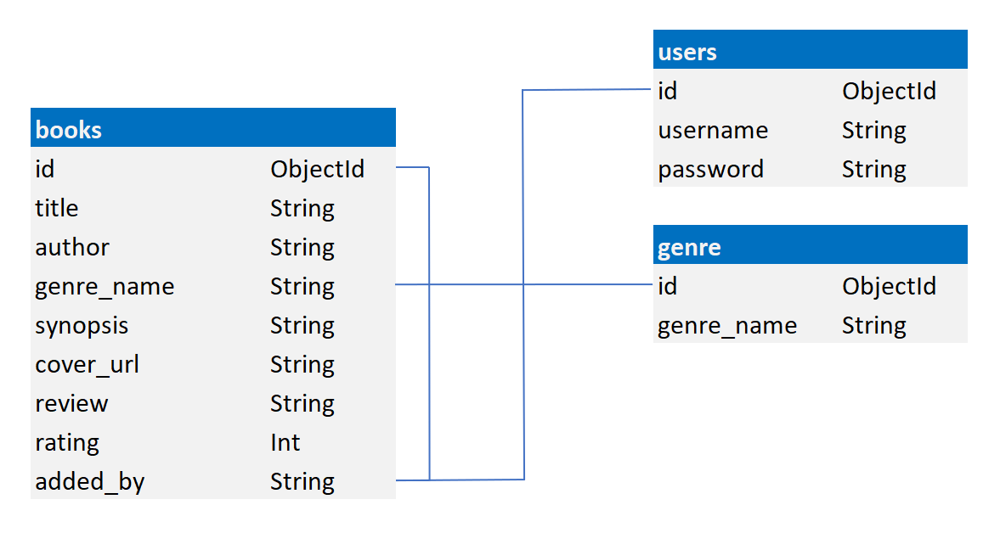
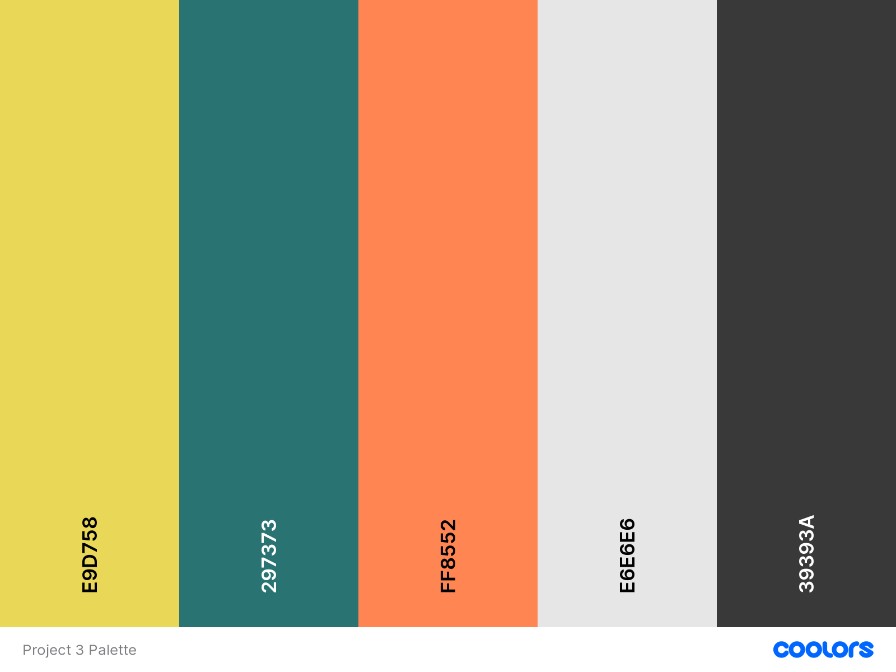

# Bookworm

View the deployed site [here:](https://bookworm-project3.herokuapp.com/)

## User Experience (UX)

---

### Introduction
Bookworm is an interactive book review site for all book fans. The site allows registered users to search through the listed books for reviews and find their next book. Bookworm allows users to share their book reviews with fellow book lovers on the site. The site also allows registered users to keep a library of their own added books on their profile page. 

---

### User Stories 

- Unregistered User
    1. As an unregistered user, I want to be able to search for books on the site.
    2. As an unregistered user, I want to  be able to view reviews for each book.
    3. As an unregistered user, I want to  be able to Register as a new User on the site.    
    4. As an unregistered user, I want to  be able to get visual feedback when an action is completed.
    5. As an unregistered user, I want to  be able to contact the Site Owner with any questions or suggestion.

* Registered user
    1. As a registered user, I want to be able to login and logout of the site.
    2. As a registered user, I want to be able to search for books.
    3. As a registered user, I want to be able to add books.
    4. As a registered user, I want to be able to view all books that I have added on my profile page.
    5. As a registered user, I want to be able to write reviews about any book.
    6. As a registered user, I want to be able to edit my books and my reviews.
    7. As a registered user, I want to be able to delete my books.
    8. As a registered user, I should not be able to delete or edit other user’s books.

- Site Admin
    1. As the site owner, I want to be able to add books.
    2. As the site owner, I want to be able to edit any book.
    3. As the site owner, I want to be able to delete any book.
    7. As the site owner, I want to be able to add a genre.
    8. As the site owner, I want to be able to edit a genre.
    9. As the site owner, I want to be able to delete a genre.
    10. As the site owner, I want to be able to reset a user’s password.
    11. As the site owner, I want to be able to delete a user’s account.  

---

### Features
#### Current Features

* Site is responsive on all screen sizes.
* Nav menu adjusts accordingly to unregistered, registered users and Admin depending on the users log in status.
* Identical footer and Navigation bar displayed across the site to provide continuity.
* Search bar on home page and profile page enables both registered and unregistered users to search for books by book title or author.
* Site visitors can register on the site.
* Registered users can log in and out of the site.
* Registered users can add books to the site, the book will also be displayed in their Library shown on their Profile page.
* Registered users can only edit their own added book.
* Registered users can only delete their own books.
* Admin users can add, edit and delete any books.
* Admin user can add, edit and delete any genre.
* Before a user deletes a book a confirmation is required preventing accidental deletion.
* Cancel buttons are also shown alongside edit and delete buttons in case the user changes their mind and wants to cancel changes.
* Social Media Links displayed in the footer on all pages.
* Contact Page allows user to contact site owner.
* Flash messages providing user feedback for registered users when initially registered, logged in, logged out.

#### Future Features

* Registered Users can review books before adding them to the site.
* Admin users can edit the users password.
* Admin users can delete any users account.
* Pagination for the Home and Profile Pages
* Separate review section linked to the book for more in depth reviews.
* Allow all users to review any book and to rate the book
* Function to add all rating scores provide an average overall rating for the book.

---

### Structure
* Home Page
All users can view the Home page whether they are logged in or not. The Search bar is visible at the top of this page for logged in or out users and they are able to search books on the database by author or title. 
All books in the database are list on the home page. Users are presented with additional edit and delete buttons at the bottom of each book card, allowing them to edit or delete their own books. The admin user will have the edit and delete buttons at the bottom of every book card, enabling admin to delete or edit any book in the database.
* Profile
The profile navigation link is only available to logged in users. Once selected, the user is taken to their own Library page with their username and Library as a heading. Books added by the user are displayed along with the edit and delete buttons to manage their library.

* Add Book
The add book menu item is available to all logged in users. Once selected, the user is presented with a form where the user is required to complete all fields including, Book Title, Author, Genre(a dropdown list selection displays all available genres), Synopsis. There is also a field for Review, where the user can input a short comment on the book, this is followed by a Rate Book field where the user can select from the dropdown field a score between 0 and 5. Finally there is a field for the Cover URL to display the books cover on the database. There is an additional Add Book button at the bottom to submit the form along with a cancel button to allow the user to come out of the form if they entered there by mistake.

* Manage Genres
This navigation link is only available to the admin user when logged in. 
Once selected, the admin user is presented with a page of cards displaying each genre on the database along with an edit and delete button to edit or delete existing genres on the database.
At the top centre of the page there is an Add Genre button allowing the user to add a new genre to the database, once selected the admin user is presented with a form with a single text input to enter the new genre. There is also an Add Genre button and delete button on the card to either submit or cancel out of the form.  

* Log Out
The Log Out navigation link is only available to logged in users. This allows the current user to log out, once selected they are presented with a flash message “You are now logged out”, the user is also redirected to the Log In screen.

* Log In
The Log In navigation link is available to all logged out or unregistered users. There is a simple form with two test inputs for Username and Password, both have to match to allow the user access. Once these two fields are completed the user has to press the Log In button. If a user does not complete a field a please fill out this field message is displayed. If a user enters an incorrect username and or password a flash message is displayed prominently across the top of the page “Incorrect Username and/or Password, please try again”. There is also a message displayed at the bottom of the Log In screen, “New to Bookworm? Register Here!” With Register Here! Taking the visitor to the Register page.

* Register
The Register navigation link is available to all logged out or unregistered users. There is a simple form with two test inputs for Username and Password, the Username and Password fields have to be between 5 and 15 characters a-z, A-Z or 0-9, no special characters allowed. 
Once these two fields are completed the user has to press the Register button. If a user does not complete a field in the correct format a message is displayed “Please match the selected format”. If a user enters a valid username and password a flash message is displayed prominently across the top of the page “You have successfully registered!”. The new user is directed to their profile page.

* Contact
The Contact navigation link is available to logged in/out users and unregistered visitors. Once selected the user is presented with a contact form with four fields, First Name, Last Name, Email and Your Comments. There is a send button at the bottom centre of the form.

#### Database Schema
There are three collections in the MongoDB database:
1. users
2. books
3. genres

The database schema is shown below.

---

### Design
#### Colour Scheme
I used [Coolors](https://coolors.co/) to generate a colour scheme, I chose this particular colour scheme because I did not want to go with the usual browns of a book review site. I wanted the site to stand out from other book review sites by including a more colourful palette.

The colours chosen are intended to convey the feeling of relaxation and calmness when reading a book, while also attracting new user to the site. I selected only three of the colours to keep the site simple and less busy. 

The main colour used on all nav bars and footers was #297373 with the lighter #CCFFFF to ensure excellent readability. The main background colour was left as white #ffffff to ensure the book covers stood out on the page. This background colour was also perfect to use the #297373 again for the text. All cards use the colour #E6E6E6 from my colour palette with the text colour of #297373, once again ensuring that it could be easily read and complimented the background colour. 

[Adobe Color-Wheel](https://color.adobe.com/create/color-wheel) was used to match a complimentary colour for all buttons on the #297373 background, #F7C9AD was chosen as this colour stood out and highlighted the buttons on the page.

#### Typography

I used [Google Fonts](https://fonts.google.com/) to import the fonts used for this site. 
The __Source Serif Pro__ font is used for all headers and titles. Designed by Frank Grießhammer, from the Adobe Originals program started in 1989 as an in-house type foundry at Adobe.
__Source Sans Pro__ was designed to perfectly compliment Source Serif Pro, I used the Source Sans Pro font for the main text throughout the site. Both fonts work perfectly together, they are easy to read and help convey the subject of the site.
Both fonts are fully cleared for both personal and commercial use.

#### Imagery
I have not used a background image on this site because I felt it would distract from the main focus of the site, the actual books with their cover images. Book cover images were taken directly from [Amazon](https://www.amazon.co.uk/).

Icons from [Font Awesome](https://fontawesome.com/) are used throughout the site. The icons help inform the user of the purpose of a particular section and lead to a more enjoyable user experience. I have also used a Font Awesome icon as my main logo displayed throughout the site <i class="fa-solid fa-book-open"></i>

#### Wireframes

The wireframes for the Bookworm site were produced using Balsamiq. 
* Mobile Wireframes:
  - [Home Logged Out/Not Registered Page](static/wireframes/home-logged-out-mobile.png)
  - [Register Page](static/wireframes/register-mobile.png)
  - [Log In Page](static/wireframes/login-mobile.png)
  - [Profile Page](static/wireframes/profile-mobile.png)
  - [Add Book Page](static/wireframes/add-book-mobile.png)
  - [Edit Book Page](static/wireframes/edit-book-mobile.png)
  - [Admin Profile Page](static/wireframes/admin-profile-mobile.png)
  - [Admin Manage Genres](static/wireframes/manage-genres-mobile.png)
  - [Admin Manage Users](static/wireframes/…………..png)
  - [Contact Page](static/wireframes/contact-page-mobile.png)

* Desktop Wireframes:
  - [Home Logged Out/Not Registered Page](static/wireframes/home-logged-out-desktop.png)
  - [Register Page](static/wireframes/register-desktop.png)
  - [Log In Page](static/wireframes/logged-in-desktop.png)
  - [Profile Page](static/wireframes/profile-desktop.png)
  - [Add Book Page](static/wireframes/add-book-desktop.png)
  - [Edit Book Page](static/wireframes/edit-book-desktop.png)
  - [Admin Profile Page](static/wireframes/admin-profile-desktop.png)
  - [Admin Manage Genres](static/wireframes/manage-genres-desktop.png)
  - [Admin Manage Users](static/wireframes/…………..png)
  - [Contact Page](static/wireframes/contact-page-desktop.png)

---

### Technologies Used

#### Languages Used

* [HTML5](https://developer.mozilla.org/en-US/docs/Glossary/HTML5)
* [CSS3](https://developer.mozilla.org/en-US/docs/Web/CSS)
* [JavaScrip](https://www.javascript.com/)
* [Python3](https://www.python.org/)

#### Frameworks, Libraries & Programs Used

* [Balsamiq:](https://balsamiq.com/)
Balsamiq was used to create the wireframes during the design process.
* [Google Fonts:](https://fonts.google.com/)
Google fonts were used to import the fonts used in this project.
* [MongoDB:](https://www.mongodb.com/) 
Cloud based database was used for all collections.
* [Flask:](https://flask.palletsprojects.com/en/2.1.x/) 
Micro framework used to build my application.
* [Materialize:](https://materializecss.com/)
Used for the structure, Navbar, Footer, Cards code used and modified for this project. 
* [Chrome DevTools:](https://developer.chrome.com/docs/devtools/)
Used throughout the project to view and edit the site in real time and discover issues and solutions.
* [Adobe Color:](https://color.adobe.com/create/color-contrast-analyzer)
The contrast checker used for this project.
* [Techsini:](https://techsini.com/multi-mockup/index.php)
To produce mockup image across multiple devices.
* [Gitpod:](https://gitpod.io/projects)
This was the code editor used throughout the project.
* [Git:](https://git-scm.com/)
Git was used for version control by utilizing the Gitpod terminal to commit to Git and Push to GitHub.
* [GitHub:](https://github.com/)
Github was used to host and deploy the website.
* [Heroku:](https://id.heroku.com/)
For deploying the application.

---

### Testing

#### W3C Markup Validation Results
#### W3C Vilidator Results
#### JSHint Results
#### Pep8 Validation
#### Lighthouse Testing
#### Testing User Stories
#### Manual Testing
#### Bugs

---

### Deployment

---

### Credits

#### Code
#### Content
#### Media
#### Acknowledgements

### Deployment